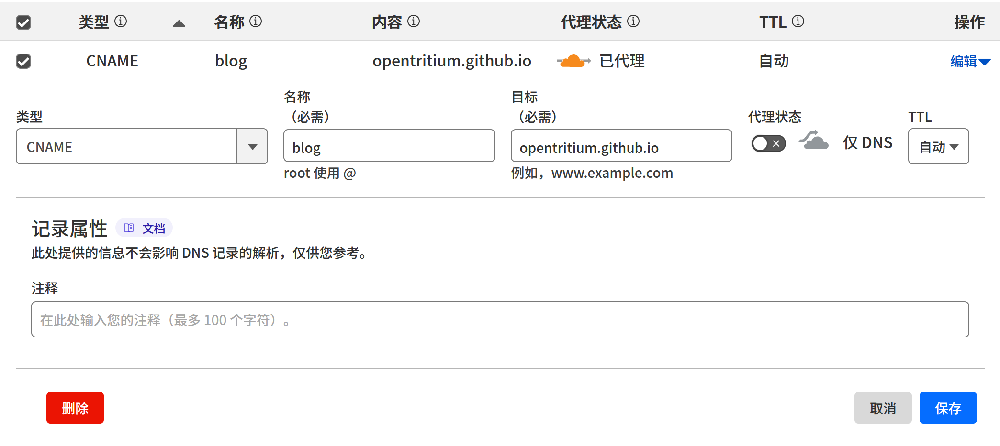
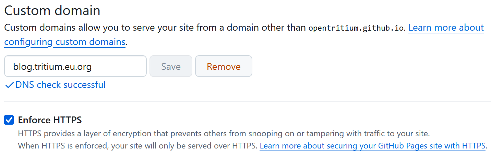
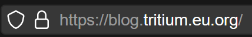

利用 Cloudfalre 提供的 DNS 与 CDN 服务加速 Github Pages 的访问

<!--more-->

在一切开始之前，你需要在 Cloudflare 域名解析控制台填写 github 的 CNAME 记录：



要想检测记录变化没有，你需要刷新一手 DNS 缓存，然后再去挖记录：

```sh
tritium@KOVA /m/c/U/T/Desktop> sudo systemd-resolve --flush-caches
tritium@KOVA /m/c/U/T/Desktop> dig blog.tritium.eu.org

; <<>> DiG 9.20.4 <<>> blog.tritium.eu.org
;; global options: +cmd
;; Got answer:
;; ->>HEADER<<- opcode: QUERY, status: NOERROR, id: 1629
;; flags: qr rd ad; QUERY: 1, ANSWER: 3, AUTHORITY: 0, ADDITIONAL: 0
;; WARNING: recursion requested but not available

;; QUESTION SECTION:
;blog.tritium.eu.org.           IN      A

;; ANSWER SECTION:
blog.tritium.eu.org.    0       IN      A       185.199.108.153
blog.tritium.eu.org.    0       IN      A       185.199.111.153
blog.tritium.eu.org.    0       IN      A       185.199.109.153

;; Query time: 489 msec
;; SERVER: 172.31.128.1#53(172.31.128.1) (UDP)
;; WHEN: Wed Dec 18 17:41:00 CST 2024
;; MSG SIZE  rcvd: 104

```

这几条记录都是 CNAME 到 `github.io` 然后 github 返回 A 记录取得的。这些 IP 就是 Github 的，你可以查询到（我是纯粹眼熟了）。

随即你需要将你的子域名填写到 Github Pages 的配置里，然后稍等它 DNS 检查一会儿，你就可以选择开启强制 HTTPS 了。



此时可以尝试访问你的域名了，如果你发现返回的页面缺失了样式以及内容，那请检查你的网站 `baseURL`。

你可以从浏览器的锁看出来 HTTPS 是生效的。



接着我们还是将 Cloudflare 的 代理打开，免费的 CDN 不香吗。接着把 TLS 加密，缓存所有内容，ZSTD 压缩，HTTP 重定向到 HTTPS 开启，这些可以大大提升我们的（静态）网站的可用度以及性能（国内可能又是另一种样子）。
