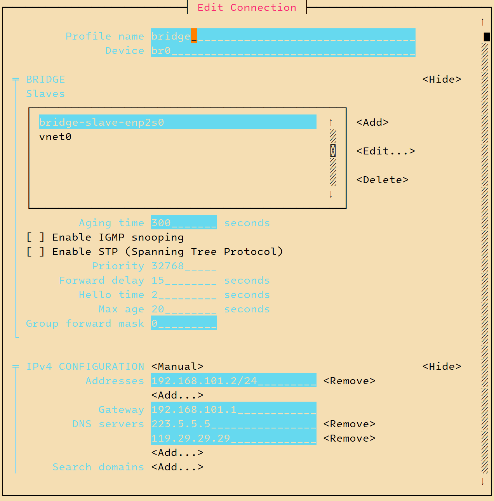
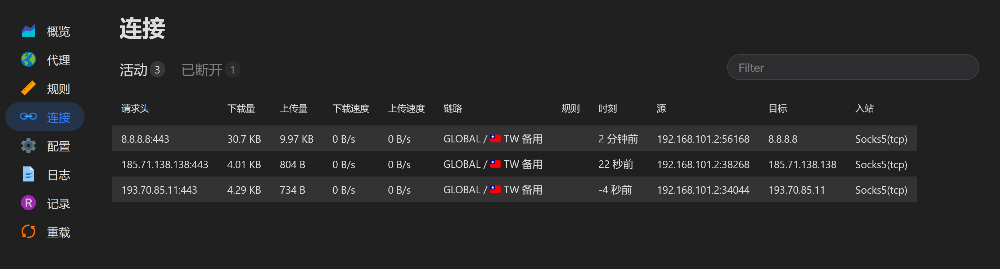
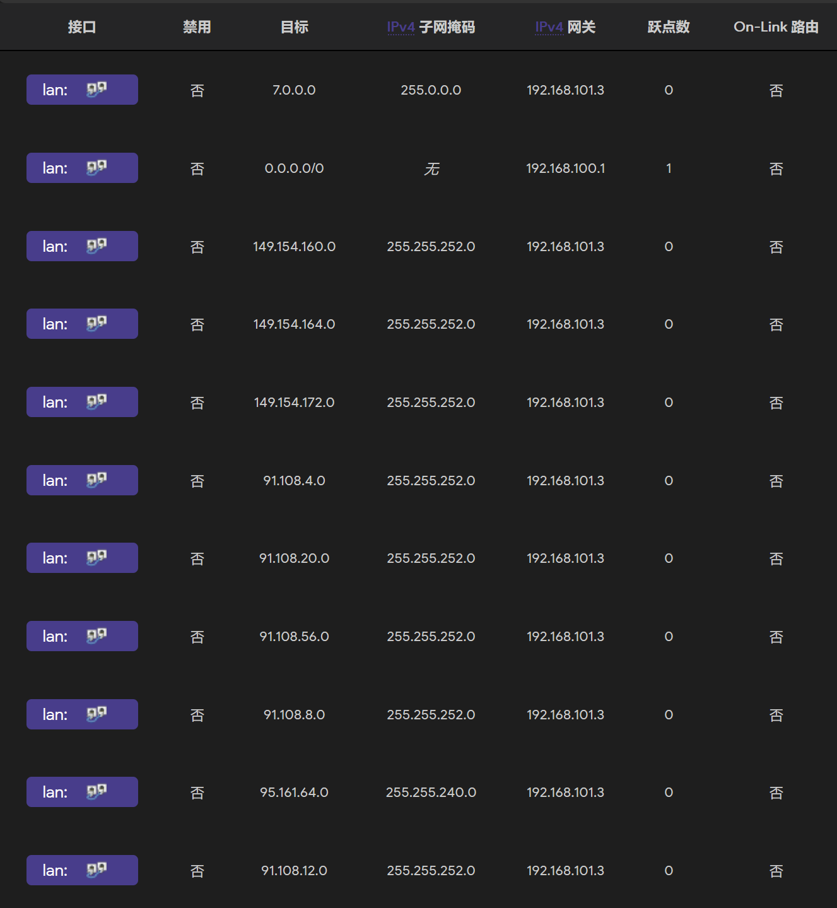

基于泡泡 DNS 与泡泡 FakeIP 网关联动实现的智能分流代理。

<!--more-->

## 硬件要求

实现这套方案并不复杂，只需要你在局域网增加一个小主机。机器的选择有点要求：

- 内存 4G 及以上（因为要运行 Docker 以及 kvm/qemu 虚拟机）
- 处理器是 x86 平台并且支持 AES 等常用加密指令集（因为网关的 ISO 镜像是 x86 的捏，加密指令集可以显著降低数据包加密的开销）
- 网卡带宽不小于出口带宽（不然会造成瓶颈）

> 你可以使用以下命令来检测当前 CPU 是否支持 AES：
>
> ```sh
>tritium@clr-e38fa31572054b38a08c66723cb0733b ~ % cpuid | grep -i aes | sort | uniq
>      AES instruction                         = false
>      VAES instructions                        = false
> ```
>
> 没错，它的确不支持，谁让它只需要 99 块呢。

## 操作系统

小主机的性能本来就很羸弱了，所以我给它装上了对 Intel 处理器有血统加成的 Linux 发行版 ClearLinux（其实它对 AMD 也有加成）。


ClearLinux 是无状态的，即使你把所有配置删除，应用也会遵从默认配置工作（如果 `/etc/` 下没有配置文件，就回退到 `/usr/share/defaults/` 下面的默认配置）。它的软件是通过容器包格式打包的，大概是为了便于管理依赖和原子化升级吧。

## 环境部署

### [泡泡 DNS](https://github.com/kkkgo/PaoPaoDNS)

暂时抛开 ClearLinux 的使用手册，我们先来一份 `docker-compose.yml` 部署 DNS 服务器吧：

```yml
version: '3'
services:
  paopaodns:
    image: sliamb/paopaodns:latest
    container_name: paopaodns
    restart: unless-stopped
    volumes:
      - /home/tritium/paopaodns:/data
    environment:
      - UPDATE=daily
      - CNAUTO=yes
      - IPV6=yes
      - SOCKS5=192.168.101.3:1080
      - CUSTOM_FORWARD=192.168.101.3:53
      - AUTO_FORWARD=yes
      - AUTO_FORWARD_CHECK=yes
      - USE_MARK_DATA=yes
      - TZ=Asia/Shanghai
      - SERVER_IP=192.168.101.2
      - HTTP_FILE=yes
    network_mode: "host"
```

这里我没有使用端口转发，请自行解决其他程序占用 53 以及 530X 端口的问题（例如 `systemd-resolved`）。

 [泡泡 DNS](https://github.com/kkkgo/PaoPaoDNS) 会从上游查询记录并缓存，部署在内网大概能降低那么十几毫秒的延迟吧大概。仅仅是把它当作一个递归域名系统就屈才了，我们接下来还要部署[泡泡网关](https://github.com/kkkgo/PaoPaoGateWay)，让它们内外勾结，“走私”出海流量。

### [泡泡网关](https://github.com/kkkgo/PaoPaoGateWay)

为了让网关的性能尽可能高，你需要定制一下镜像，定制镜像则通过一个 Docker 镜像来实现，详情参考：[sliamb/ppgwiso](https://github.com/kkkgo/PaoPaoGateWay?tab=readme-ov-file#%E4%BD%BF%E7%94%A8docker%E5%AE%9A%E5%88%B6iso%E9%95%9C%E5%83%8Fppwgiso)。

如果你想从 泡泡 DNS 的文件服务器拉网关的配置文件就请你在 `network.ini` 将 DNS 设置成泡泡 DNS 的地址：

```ini
ip=192.168.101.3
mask=255.255.255.0
gw=192.168.101.1
dns1=192.168.101.2
```

我们需要为镜像补全一些 virtio 的驱动，并开启前置嗅探：

```sh
docker pull sliamb/ppgwiso:fullmod
docker run --rm -e SNIFF=yes -v .:/data sliamb/ppgwiso:fullmod
```

> **前置嗅探**
>
> - 可以在 TLS 握手阶段就从数据包中提取出 SNI，即使 FAKE DNS 映射错了，还有正确的嗅探结果保底
> - 识别 BT 流量禁止其经过代理

随后编写一份 `virsh` 认识的 `xml` 配置再 `virsh define` 就行了：

```xml
<domain type='kvm'>
  <name>paopao_gateway</name>
  <uuid>75440171-9ff8-43bf-aac5-67a02b80bc6a</uuid>
  <memory unit='KiB'>2097152</memory>
  <currentMemory unit='KiB'>2097152</currentMemory>
  <memoryBacking>
    <source type='memfd' />
    <access mode='shared' />
  </memoryBacking>
  <vcpu placement='static'>2</vcpu>
  <os>
    <type arch='x86_64' machine='q35'>hvm</type>
    <boot dev='cdrom' />
  </os>
  <features>
    <acpi />
    <apic />
  </features>
  <cpu mode='host-passthrough' check='none' migratable='off' />
  <clock offset='localtime' />
  <on_poweroff>destroy</on_poweroff>
  <on_reboot>restart</on_reboot>
  <on_crash>destroy</on_crash>
  <devices>
    <emulator>/usr/bin/qemu-system-x86_64</emulator>
    <controller type='scsi' model='virtio-scsi' index='0'>
      <address type='pci' domain='0x0000' bus='0x00' slot='0x01' function='0x0' />
    </controller>
    <disk type='file' device='cdrom'>
      <driver name='qemu' type='raw' />
      <source file='/var/lib/libvirt/isos/paopao_gateway.iso' />
      <target dev='hda' bus='scsi' />
      <readonly />
      <address type='drive' controller='0' bus='0' target='0' unit='0' />
    </disk>
    <controller type='pci' index='0' model='pcie-root' />
    <controller type='virtio-serial' index='0'>
      <address type='pci' domain='0x0000' bus='0x00' slot='0x03' function='0x0' />
    </controller>
    <interface type='bridge'>
      <mac address='52:54:01:f3:4e:4e' />
      <source bridge='br0' />
      <model type='virtio' />
      <address type='pci' domain='0x0000' bus='0x00' slot='0x02' function='0x0' />
    </interface>
    <serial type='pty'>
      <target type='isa-serial' port='0'>
        <model name='isa-serial' />
      </target>
    </serial>
    <console type='pty'>
      <target type='virtio' port='0' />
    </console>
    <memballoon model='virtio'>
      <address type='pci' domain='0x0000' bus='0x00' slot='0x04' function='0x0' />
    </memballoon>
  </devices>
</domain>
```

我保留了 pty，方便 `virsh console` 进去调试，设备全是 virtio 一把梭。这个虚拟机不需要分配虚拟磁盘，引导进 ISO 它就开始工作了。

还需要注意的事是，你需要配置一个逻辑上的网桥，为网桥分配 IP，再将物理网卡和虚拟机的网卡一起接上去，才好让虚拟网卡接上去。



```sh
tritium@clr-e38fa31572054b38a08c66723cb0733b ~ % ifconfig
br0: flags=4163<UP,BROADCAST,RUNNING,MULTICAST>  mtu 1500
        inet 192.168.101.2  netmask 255.255.255.0  broadcast 192.168.101.255
        inet6 [REDACTED]  prefixlen 64  scopeid 0x0<global>
        inet6 [REDACTED]  prefixlen 64  scopeid 0x0<global>
        inet6 fe80::6b0a:e740:2c2b:b6f9  prefixlen 64  scopeid 0x20<link>
        inet6 [REDACTED]  prefixlen 64  scopeid 0x0<global>
        inet6 [REDACTED] prefixlen 64  scopeid 0x0<global>
        inet6 [REDACTED] prefixlen 64  scopeid 0x0<global>
        inet6 [REDACTED]  prefixlen 64  scopeid 0x0<global>
        ether be:dc:22:23:ab:58  txqueuelen 1000  (Ethernet)
        RX packets 2675127  bytes 717160015 (683.9 MiB)
        RX errors 0  dropped 0  overruns 0  frame 0
        TX packets 2359597  bytes 332729500 (317.3 MiB)
        TX errors 0  dropped 5 overruns 0  carrier 0  collisions 0

br-a0ac08ff651b: flags=4099<UP,BROADCAST,MULTICAST>  mtu 1500
        inet 172.19.0.1  netmask 255.255.0.0  broadcast 172.19.255.255
        ether 02:42:58:11:91:b8  txqueuelen 0  (Ethernet)
        RX packets 0  bytes 0 (0.0 B)
        RX errors 0  dropped 0  overruns 0  frame 0
        TX packets 0  bytes 0 (0.0 B)
        TX errors 0  dropped 2 overruns 0  carrier 0  collisions 0

docker0: flags=4099<UP,BROADCAST,MULTICAST>  mtu 1500
        inet 172.17.0.1  netmask 255.255.0.0  broadcast 172.17.255.255
        ether 02:42:f0:a1:80:c8  txqueuelen 0  (Ethernet)
        RX packets 0  bytes 0 (0.0 B)
        RX errors 0  dropped 0  overruns 0  frame 0
        TX packets 0  bytes 0 (0.0 B)
        TX errors 0  dropped 2 overruns 0  carrier 0  collisions 0

enp2s0: flags=4163<UP,BROADCAST,RUNNING,MULTICAST>  mtu 1500
        ether 00:e0:b4:54:b9:0d  txqueuelen 1000  (Ethernet)
        RX packets 13846088  bytes 13872011633 (12.9 GiB)
        RX errors 0  dropped 0  overruns 0  frame 0
        TX packets 15694010  bytes 13525969550 (12.5 GiB)
        TX errors 0  dropped 0 overruns 0  carrier 0  collisions 0

lo: flags=73<UP,LOOPBACK,RUNNING>  mtu 65536
        inet 127.0.0.1  netmask 255.0.0.0
        inet6 ::1  prefixlen 128  scopeid 0x10<host>
        loop  txqueuelen 1000  (Local Loopback)
        RX packets 416363  bytes 49702017 (47.3 MiB)
        RX errors 0  dropped 0  overruns 0  frame 0
        TX packets 416363  bytes 49702017 (47.3 MiB)
        TX errors 0  dropped 0 overruns 0  carrier 0  collisions 0

vnet0: flags=4163<UP,BROADCAST,RUNNING,MULTICAST>  mtu 1500
        inet6 fe80::fc54:1ff:fef3:4e4e  prefixlen 64  scopeid 0x20<link>
        ether fe:54:01:f3:4e:4e  txqueuelen 1000  (Ethernet)
        RX packets 8703185  bytes 13004748889 (12.1 GiB)
        RX errors 0  dropped 0  overruns 0  frame 0
        TX packets 14080044  bytes 13597251730 (12.6 GiB)
        TX errors 0  dropped 0 overruns 0  carrier 0  collisions 0
```

啊我发现我好像多出个网桥，使用 `docker network ls` 检查后果然是以前部署青龙面板创建的，使用以下命令移除所有没有被使用的网络：

```sh
docker network prune
```

我好像低估了 DNS 查询带来的流量消耗。

其实你还需要创建一份 `ppgw.ini` 扔到泡泡 DNS 的数据目录下，再开启文件服务器（之前的环境变量已经实现了）。这样泡泡网关访问 `paopao.dns` 域名时会被解析到泡泡DNS的内网 IP，然后网关就可以从 DNS 服务器上面下载配置了。

```ini
mode=suburl
fake_cidr=7.0.0.0/8
dns_ip=192.168.101.2
dns_port=5304
# 面板端口
clash_web_port="80"
# 面板密码
clash_web_password="********"
openport=yes
# 有些机场支持 UDP 的
udp_enable=yes
sleeptime=30
suburl="填你自己的机场订阅链接"
subtime=6h
fast_node=yes
test_node_url="https://www.youtube.com/generate_204"
ext_node="Traffic|Expire| GB|Days|Date|过滤词"
cpudelay="3000"
fall_direct="no"
dns_burn=yes
ex_dns="192.168.101.2:53"
net_rec=no
max_rec=5000
```

泡泡网关默认是每 30 秒尝试拉一次配置，你要是懒得等可以 pty 进去输入 `reload`。订阅啥的配置文件全部拉下来并开始正常工作的时候你才能通过 `http://网关IP:80/ui` 访问 yacd 面板。



## DHCP 服务和静态路由

你可以在路由器上面配置 DHCP 服务器或者在小主机上部署 DHCP 服务，切记一山不容二虎。我们需要将默认 DNS 宣告成我们内网搭建的 DNS 服务器，然后可以在 DHCP 报文里夹带一些静态路由，这样可以少跳一次主路由直接到旁路由。我选择的是 dnsmasq 提供 DHCP 服务：

```conf
dhcp-option=option:router,192.168.101.1
dhcp-option=option:dns-server,192.168.101.2
dhcp-option=121,7.0.0.0/8,192.168.101.3
```

这些够了，你要是还想将一些 IP 段路由到出海网关，可以在这里继续写，可以在主路由的路由表里写，也可以两个都写确保兼容性。

确保静态路由里有特殊网段的路由（对于某些访问 IP 而不是域名的应用，下面的例子中大部分都是 Telegram 的服务器网段），还有一条默认路由到出口：



## 测试连接

```sh
tritium@KOVA /m/c/U/T/Desktop> dig paopao.dns

; <<>> DiG 9.20.4 <<>> paopao.dns
;; global options: +cmd
;; Got answer:
;; ->>HEADER<<- opcode: QUERY, status: NOERROR, id: 34099
;; flags: qr rd ad; QUERY: 1, ANSWER: 1, AUTHORITY: 0, ADDITIONAL: 0
;; WARNING: recursion requested but not available

;; QUESTION SECTION:
;paopao.dns.                    IN      A

;; ANSWER SECTION:
paopao.dns.             0       IN      A       192.168.101.2

;; Query time: 0 msec
;; SERVER: 172.31.128.1#53(172.31.128.1) (UDP)
;; WHEN: Tue Dec 17 01:36:52 CST 2024
;; MSG SIZE  rcvd: 54
```

SERVER 的地址不对是因为我是在 WSL 里执行的，经过了一次 NAT。国内域名是正常解析的：

```sh
tritium@KOVA /m/c/U/T/Desktop> dig www.bilibili.com A +noall +answer
www.bilibili.com.       0       IN      CNAME   a.w.bilicdn1.com.
a.w.bilicdn1.com.       0       IN      A       119.84.174.68
a.w.bilicdn1.com.       0       IN      A       119.84.174.96
a.w.bilicdn1.com.       0       IN      A       119.84.174.97
a.w.bilicdn1.com.       0       IN      A       119.84.174.66
a.w.bilicdn1.com.       0       IN      A       119.84.174.67
tritium@KOVA /m/c/U/T/Desktop> dig www.bilibili.com AAAA +noall +answer
www.bilibili.com.       0       IN      CNAME   a.w.bilicdn1.com.
a.w.bilicdn1.com.       0       IN      AAAA    240e:930:c200:209::34
a.w.bilicdn1.com.       0       IN      AAAA    240e:930:c200:209::35
a.w.bilicdn1.com.       0       IN      AAAA    240e:930:c200:209::36
a.w.bilicdn1.com.       0       IN      AAAA    240e:930:c200:209::45
a.w.bilicdn1.com.       0       IN      AAAA    240e:930:c200:209::46
a.w.bilicdn1.com.       0       IN      AAAA    240e:bf:b800:4300:1::12
a.w.bilicdn1.com.       0       IN      AAAA    240e:bf:b800:4300:1::13
a.w.bilicdn1.com.       0       IN      AAAA    240e:bf:b800:4300:1::15                                    
```

试试小 B 站的解析：

```sh
tritium@KOVA /m/c/U/T/Desktop> dig www.youtube.com AAAA +noall +answer
tritium@KOVA /m/c/U/T/Desktop> dig www.youtube.com A +noall +answer
www.youtube.com.        0       IN      A       7.0.1.104
```

外国的 AAAA 好像没记录欸，是因为前面泡泡 DNS 的环境变量中的 `IPV6=yes` 而不是 `IPV6=raw`，它只会返回 IPv4 地址。如果更改为 `raw`，这样咱们还得把 IPv6 的 DNS 查询也重定向到内网 DNS 服务器来。再想想我们的网关好像暂时只能处理 IPv4 的 fakeip，况且我们的机场甚至都不一定是双栈的。所以只返回海外域名的 A 记录是利于分流的。

## 编写服务

写完以后扔 `/etc/systemd/system/` 下面，然后 `systemctl enable --now paopaodns` 即可。

```sh
[Unit]
Description=PaoPaoDNS
Requires=docker.service
After=docker.service

[Service]
WorkingDirectory=/home/tritium/configs
ExecStart=/usr/bin/docker-compose up
ExecStop=/usr/bin/docker-compose down

[Install]
WantedBy=multi-user.target
```

别忘了 libvirtd，networkmanager，dnsmasq 等服务的自启。你在 systemd 中 enable 服务后还需要再链接一次服务才能在开机后正常自启：

```sh
clr-service-restart -a
```

还有虚拟机可以使用 `virsh autostart` 来标识一个虚拟机可以自动启动。
