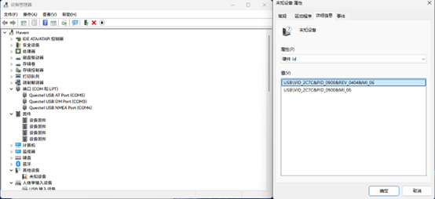

RG200U 是展讯平台的模块，希望更新后以太网不会动不动就下线了。

<!--more-->

移远在自家的[下载中心](https://www.quectel.com.cn/download-zone)提供了手册和驱动，这个下载中心和文档质量算还行了，官方的论坛的技术支持也还算活跃。

我们需要在下载中心中下载 `Quectel_Windows_USB_Driver(Q)_RNDIS_Vx.x_CN` 的 RNDIS 驱动（你可以查看每个版本的驱动手册得知你需要哪个驱动），我的模块目前是工作在 NAT 模式的，在这个模式下 RNDIS 不会实际地工作（即使你的电脑提示有这个网卡），USB 仅作串口作用。打完这个驱动后你可以用 USB 连接模块的 AT 串口了。

有一个展讯的设备没工作，不影响我们的后续操作。你也可以用串口工具连接 AT 的 COM 口，然后敲几行 AT 命令试试能不能正常通讯。

使用从下载中心拿到的 Qflash 工具，查看手册了解 RG200U 的下载口就是 AT 口就选择它，波特率也照手册上设置一下吧。

正常来说 Qflash 会让模块重启到刷入模式（`SPRD U2S Diag`，此时设备管理器会出现一个不同的串口），但是刷入模式也是需要驱动的。你需要在全网查找关于 `SPRD_NPI_USB_Driver` 第三方的存档，因为我并没有在官方支持里找到下载的地方（即使有也可能又要注册和许可）。去哪里找呢，有不少的驱动网站，或者是刷机网站（例如 XDA，你知道展讯也做手机 SoC 的），都可以获取到这个驱动。

更新的固件我是找卖家要的，当然你也可以注册论坛找技术员获取。
